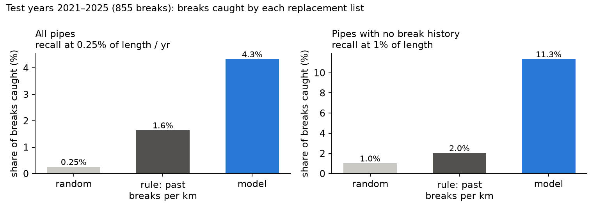
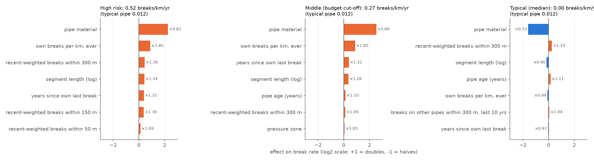
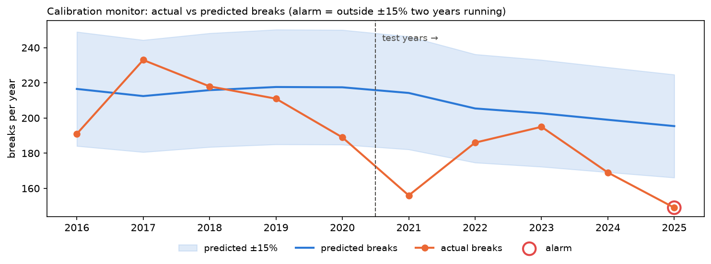
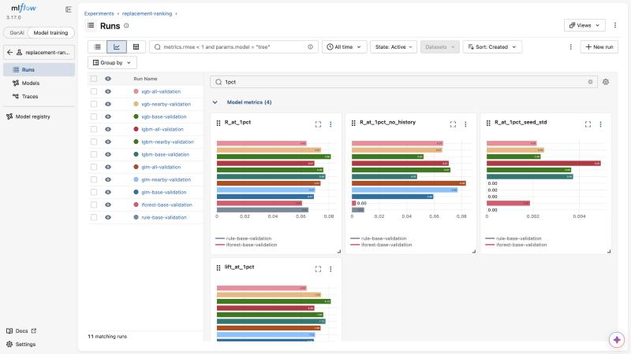

# Calgary Water Main Replacement Prioritisation — Classical ML

Avathon AI/ML Hiring Challenge · **Track C — Classical ML** · Domain: water supply network reliability (own domain, framed nearest S1 — detecting supply disruptions early)

## Problem statement

Calgary has ~5,400 km of water mains. Every break is repaired as an emergency, but the city can only
**replace** ~8–15 km a year (0.15–0.3% of the network). Each planning year the question is:
**which pipes should be replaced first so the most future breaks are avoided?**

The model ranks every pipe by its predicted break rate per km. The output is a replacement shortlist for an
asset engineer, who makes the final decision.

## Data source

City of Calgary Open Data, [Open Government Licence – City of Calgary](https://www.calgary.ca/cs/iis/licensing-city-data/licensing-city-data.html):

- [Water Main Breaks](https://data.calgary.ca/Environment/Water-Main-Breaks/dpcu-jr23) — 37,538 breaks, 1956–2026, with failure mode and location
- [Public Water Main](https://data.calgary.ca/Environment/Public-Water-Main/w6h9-w33i) — 60,740 pipe segments with material, diameter, install year and length

Breaks carry no pipe ID; each is linked to its nearest pipe (99% within 1.3 m). Only breaks on pipes still in
the ground are used.

## Approach

| Step | Choice |
|---|---|
| Unit | one row per pipe per 1 January (annual snapshots 1996–2025) |
| Label | number of breaks on the pipe during that year |
| Features | material, pressure zone, diameter, age, length; own break history (count, per km, recency); breaks on nearby pipes within 50/150/300 m — all from data before 1 January |
| Model | LightGBM, Poisson objective with log(length) offset → predicted breaks per km per year |
| Split | sliding window: for each year, train on all earlier years. Validation 2016–2020 (all choices made here), test 2021–2025 (run once) |
| Metric | recall at a length budget — share of the year's breaks on the top-ranked pipes making up 0.25% of network length (≈ one year's replacement budget), pooled over 5 years; lift = recall ÷ budget |

Compared in MLflow: past-breaks-per-km rule, Isolation Forest, Poisson GLM, LightGBM, XGBoost; feature sets
with/without failure types and nearby breaks; 5-year vs annual vs 4-year sliding designs.

## Results (test, 2021–2025, 855 breaks)

| | Rule: past breaks per km | **LightGBM + nearby breaks** |
|---|---|---|
| Recall at 0.25% of length per year | 1.6% | **3.4%** |
| Lift over random | 6.6× | **13.4×** |
| Breaks avoided over 5 years | 14 | **~29** |
| Recall at 1% on pipes with no break history | 2.0% | **11.8%** |
| Predicted ÷ actual breaks | — | 1.19 |



The model roughly doubles the breaks avoided per km replaced compared with the best simple rule, mainly by
finding pipes that have not broken yet. Validation lift was 8.2×; per-year results are noisy because one
year's budget catches only a handful of breaks.

### Why pipes rank where they do (SHAP)

Each factor is shown as a multiplier on a typical pipe's break rate. Material dominates, then recent breaks
on nearby pipes, then the pipe's own record. The top-ranked pipe is driven by its neighbourhood; the
mid-list pipe by its own break record.



### Monitoring

Feature drift (Evidently, `results/drift_report.html`) flagged only pipe age. The real degradation —
falling break rates — is caught by a yearly Evidently test: actual breaks must be within ±15% of predicted,
with an alarm after two failing years.



### Experiment tracking (MLflow)



**Limitations:** the pipe inventory is a 2026 snapshot, so historical snapshots contain only pipes that
survived to 2026; break recording changed around 2000; on the test years the model over-predicted break
counts by 19% because break rates kept falling. Feature-drift checks did not flag this (labels are 99.6%
zeros), so a yearly predicted-vs-actual monitor is included: it fails in 2021, 2024 and 2025 and raises an
alarm in 2025 — see `results/calibration_monitor.png`.

## Setup

```bash
python3.11 -m venv .venv
source .venv/bin/activate
pip install -r requirements.txt
```

## Reproducing results

1. `dvc repro` — downloads the data and builds the feature tables; `dvc.lock` records the exact file versions used
2. `notebooks/01_eda.ipynb` — data exploration
3. `python src/train.py --model lgbm --features nearby` — 5-year design runs on the validation window (models, feature sets)
4. `python src/rolling.py --design annual --window all --model lgbm` — final annual design on validation; add `--split test` for the test years
5. `notebooks/02_model_explanations.ipynb` — SHAP explanations
6. `python src/drift_report.py` — Evidently feature-drift report
7. `python src/plot_results.py` — test-recall chart
8. `python src/monitor.py` — yearly calibration monitor (Evidently test: actual breaks within ±15% of predicted; alarm after two failing years)
9. `python -m pytest tests/` — leakage test
10. `mlflow ui --backend-store-uri sqlite:///mlflow.db` — compare all runs (exported log: `results/mlflow_experiment_log.csv`; screenshot: `results/mlflow_run_comparison.jpg`)

All random seeds are fixed (stochastic models are averaged over several seeds).

## Repository structure

```
src/        download, linking, features, training, evaluation, drift report
notebooks/  01 data exploration, 02 model explanations
tests/      leakage test
results/    figures, metrics, drift and monitoring reports, MLflow log
```
